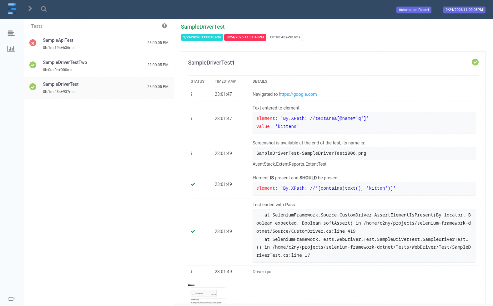

# Selenium Framework (.NET 7)

This is a reusable [Selenium](https://www.selenium.dev/) automation framework
built in C#. 

Its purpose is to help with creation of automated browser tests, I originally
made it in 2023 in .NET 7

## Features
- Supports Chrome, Firefox, Edge
- Headless support
- Reusable WebDriver helper methods and assertions
- Easy NUnit test setup/teardown and parallel test execution
- HTML reports (using ExtentReports)
- REST API testing
- Json validation (for API tests)

## What reports look like


## Structure
- `Source/` - browser and API automation code
- `Tests/WebDriver/` -  example Selenium tests
- `Tests/Api/` - example API tests
- `Utilities/` - test startup, reporting, other helping functions

## Running
You need .NET 7
```sh
dotnet restore
dotnet test
```

Graphic test reports are generated to bin/Debug/index.html

## Note
This is an older project from 2023 and it hasn't been maintained for a while.
